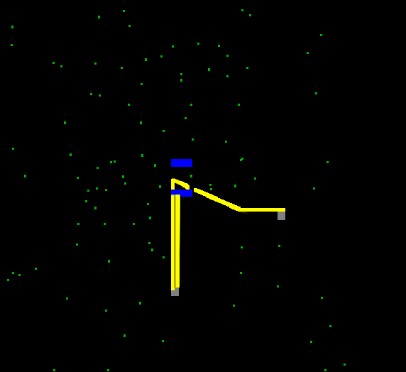

# A little openGl engine toy

This little project uses openGL to render ant's behavior.

Maybe adding more simulation in the futur

# Screenshoots
There are few examples of what this simulation can generate

